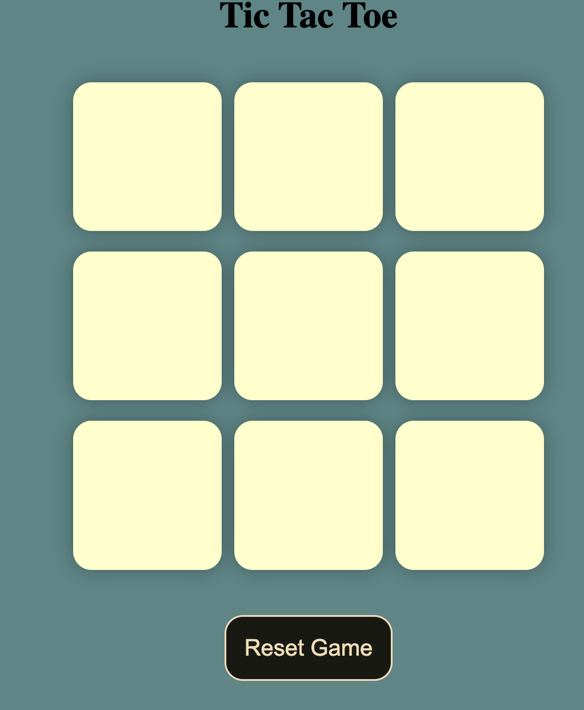
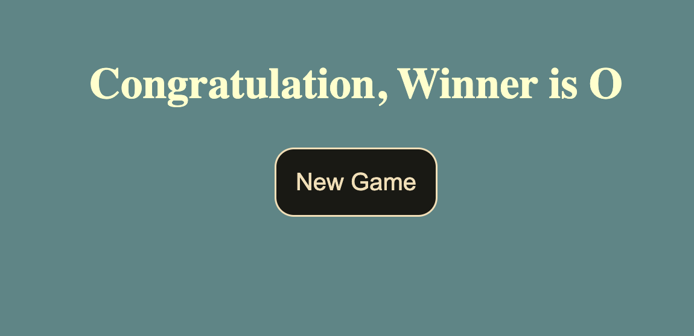

# Tic Tac Toe Game

Welcome to the Tic Tac Toe game! This classic game has been brought to life using HTML, CSS, and JavaScript to provide a fun and interactive experience for players of all ages. Below you'll find instructions on how to play and details about the implementation.

**Instructions:**

1. **Getting Started:**
   - To play the game, simply open the `index.html` file in your web browser.
   - You'll be presented with a 3x3 grid representing the Tic Tac Toe board.

2. **Gameplay:**
   - Players take turns clicking on the squares to place their symbol (either "X" or "O").
   - The first player to get three of their symbols in a row (horizontally, vertically, or diagonally) wins the game.
   - If all squares are filled and no player has achieved three in a row, the game ends in a draw.

3. **Restarting the Game:**
   - To restart the game at any point, simply refresh the webpage.

**Screenshot**    
    

**Implementation Details:**

1. **HTML:**
   - The structure of the game board is created using HTML `
` elements.
   - Each square on the board is represented by a `
` with a unique ID.

2. **CSS:**
   - The layout and styling of the game board are handled using CSS.
   - CSS is used to create the grid layout and style the appearance of the squares.

3. **JavaScript:**
   - The game logic is implemented using JavaScript.
   - Event listeners are used to detect clicks on the squares and handle player moves.
   - JavaScript functions check for winning combinations after each move to determine the winner.
   - The game state is managed dynamically using JavaScript to update the board and track player turns.

**Credits:**

This Tic Tac Toe game was created by [Rohit Kumar] as a project to practice HTML, CSS, and JavaScript programming skills. Feel free to modify and customize the game as you see fit!

Enjoy playing Tic Tac Toe!
